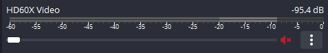

# OBS w/ Console Capture Card + Headphones + No Chat Link Cable

1. Connect the headset to your PC (this will be used to talk to your stream, but hear your capture card audio)
2. Connect a microphone to your console (this will be used only for talking in game or in party chats on console)
2. Change Settings > Audio > Global Audio Devices to the following
> 
3. Change Settings > Audio > Advanced to monitor your headset
> 
4. Add Video Capture Device source and name it the name of your capture card with “Video” at the end. Be sure to mute this in "Audio Mixer," note the red mute icon
> 
5. Add Audio Input Capture source and name it the name of your capture card with “Audio” at the end
6. Set the Audio Input Capture from step #5 to "Monitor and Output." You can do this via the gear in the Audio Mixer.
> 

## Q/A

**Q: My sound in my headphones becomes out of sync over time, but is still in sync on the stream. How do I fix this?**\
A: It seems that there's no good way around this, and it's expected to happen over time. I would recommend following
   the steps here https://github.com/MarcusBuer/OBS-Anti-Mic-Monitoring-Desync to add a script to automatically disable
   and enable the Audio Input Capture. Alternatively, you can also click the Eye button on the Audio source occasionally
   to toggle it off and on again (may need to wait a few seconds in betwween).

**Q: Do I need a separate microphone to my console?**\
A: If you want to be able to talk in game or in console party chats, and are not able to use Discord, yes. If you are able
   to use Discord, you can join a voice chat on Discord and use your same headset for everything. To do this, you will want
   to change your OBS Settings > Audio > Global Audio Devices > Desktop Audio from Disabled to something other than your headset
   (hopefully your monitors have speakers, or a soundbar, etc). In the Audio Mixer in OBS, go to Advanced Audio Properties and 
   "Monitor and Output" your Desktop Audio (NOTE: doing it this way means every audio on your desktop will be broadcast to your
   stream, so please be aware of that). In Discord Settings, change your Input Device to be your headset
   mic if it isn't already, and your output device to match your Desktop Audio. Mute your desktop device if possible, or turn it
   down so you don't hear it, since you are already listening to audio in your headphones. Connect to the voice chat from your
   PC, and your console friends should be able to also join this voice chat from PlayStation / Xbox.